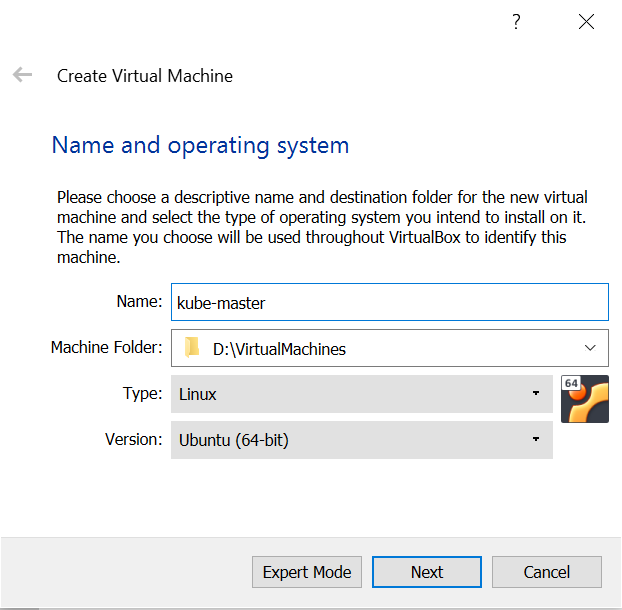
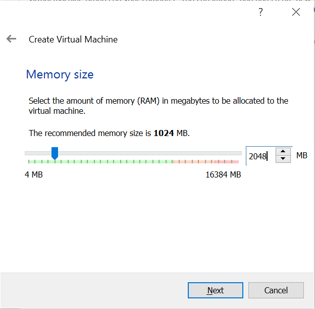
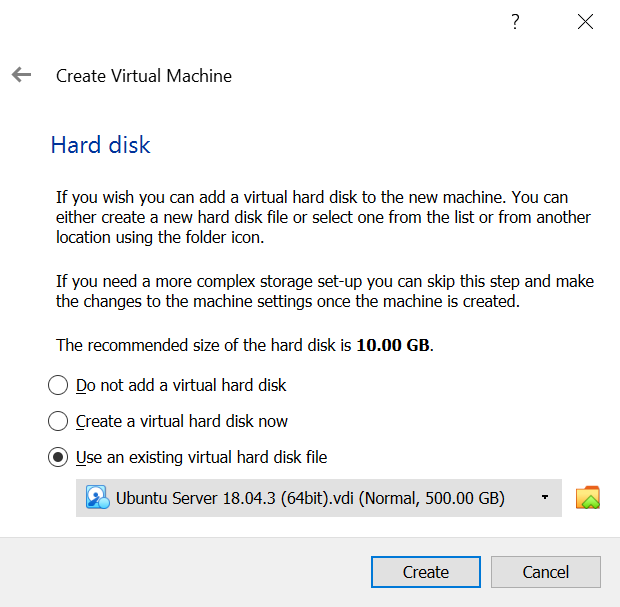
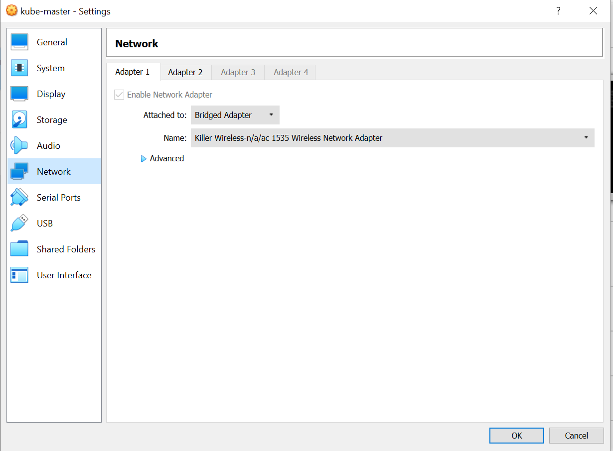
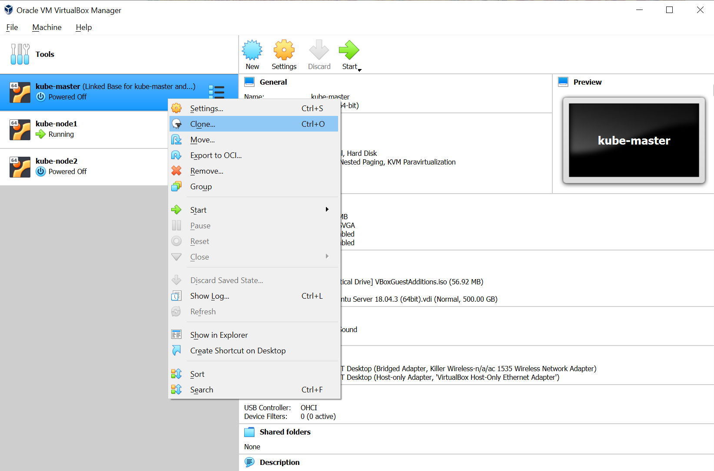
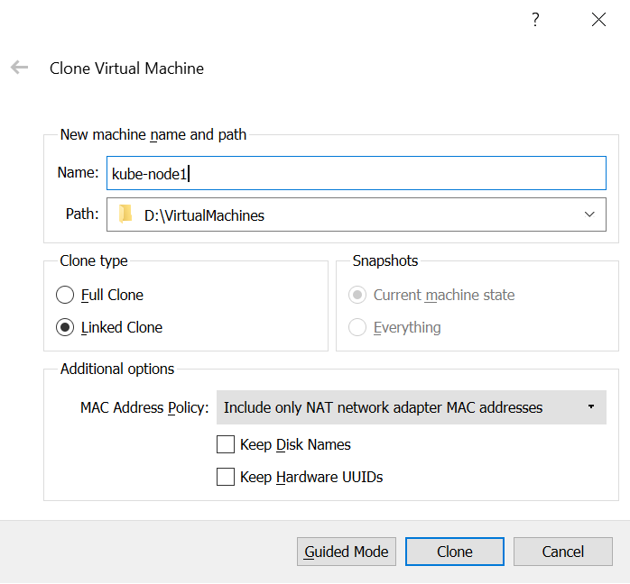
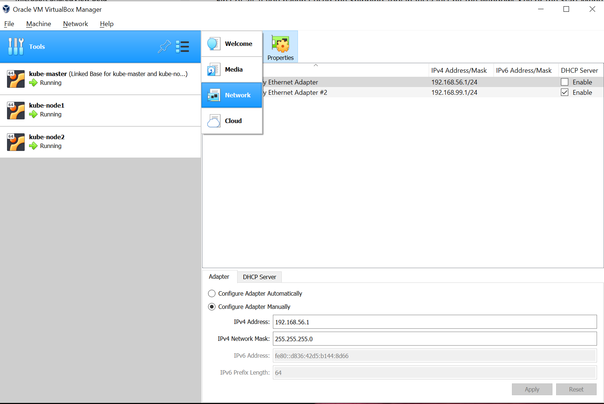
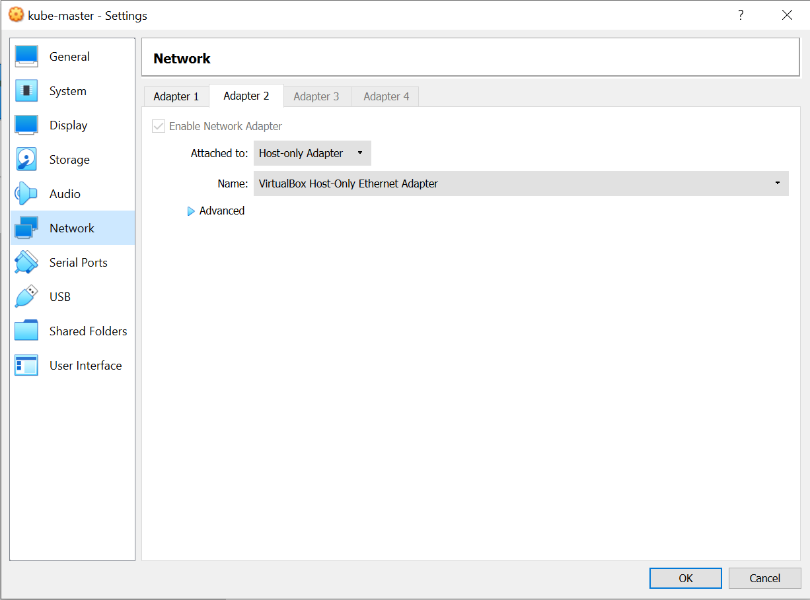

Title: Cluster de VMs con VirtualBox
Date: 2020-03-03 18:30
Category: Virtualización
Tags: cluster,vm,virtualbox,kubernetes
Slug: virtualbox-cluster
Authors: Jose L. Patino-Andres
Summary: Creación de un cluster de máquinas virtuales Ubuntu con VirtualBox.

### Motivación

En determinados entornos, por ejemplo y especialmente si nos vemos obligados a
trabajar en sistemas Windows, puede ser necesario desplegar un pequeño cluster
de máquinas virtuales Linux para probar conceptos, aprender nuevas tecnologías o
configurar "laboratorios" para experimentar o entrenar habilidades.

Aqui vamos a describir como se puede crear un pequeño cluster de 3 máquinas
virtuales basadas en Ubuntu Server 18.04 utilizando VirtualBox.

Las máquinas estaran disponibles tanto a través de una dirección IP dinámica
asignada por el mismo router al que se conecta el host Windows como a través de
una IP estática que asignaremos nosotros y que las mantendrá efectivamente en 
una subred desde la que podrán comunicarse unas con otras.

Esto puede sernos útil para desplegar un cluster Kubernetes donde una de estas
máquinas sea el nodo principal o "master" y las otras dos sean nodos disponibles
a través de la subred en los cuales desplegar "pods" de aplicaciones.

### Sistema y versiones

- Windows 10 Pro (versión 1903), máquina anfitrión.
- VirtualBox 6.1.4.
- Ubuntu Server 18.04.03 (64 bit), máquinas virtuales.

### Creación de las máquinas virtuales

Para obtener la imagen preconfigurada de una máquina virtual Ubuntu Server 
18.04, podemos descargarnos el fichero `.vdi` de [osboxes.org](https://www.osboxes.org/ubuntu-server/).

Una vez nos hemos descargado el fichero, creamos una nueva máquina con la GUI 
de VirtualBox. **Es importante configurar una memoria RAM de al menos 2048MB y
usar el fichero `.vdi` que hemos descargado de osboxes.org como disco virtual**.

Cuando ya hemos creado la primera máquina virtual, pasamos a la configuración de
red donde marcamos "Bridged Adapter", de modo que la máquina virtual utilizará
la tarjeta de red asignada en la máquina anfitrión Windows 10 como gateway.

Una vez hecho esto, podemos clonar la máquina virtual en dos máquinas más.

Debemos hacer un clon "link", no un clon "copia". De este modo ahorramos
espacio de disco.

Repetimos el mismo paso para la siguiente máquina virtual. Al final, tendremos
3 máquinas virtuales: la original ("master") y los dos clones ("nodos").

### Configuración de subred

Para configurar una subred y asignar IPs estáticas a nuestras máquinas
virtuales de modo que siempre puedan comunicarse unas con otras, primero vamos
al menú "Tools" de VirtualBox, seleccionando la opción "Network".

Tenemos que asegurarnos de que la opción "DHCP Server" aparece **desmarcada**.

Ahora vamos otra vez a la configuración de red de la máquina virtual, donde
añadimos un nuevo adaptador de red "Adapter 2", seleccionando para este la
opción "Host-only Adapter" y relacionándolo con el adaptador del host donde
antes habíamos deseleccionado la opción del servidor DHCP.

Repetimos este mismo paso para las dos máquinas clones.

Ahora estamos listos para arrancar las máquinas.

### Configuración de sistema de máquinas virtuales

Recordar que debemos instalar `openssh-server` en las máquinas para así poder
acceder a ellas desde el `cmd` de Windows 10. Esto nos permitirá ejecutar las
máquinas en modo *headless*.

Ahora debemos configurar la red en las máquinas virtuales. Esto se hace mediante
la aplicación de sistema `netplan`. Para ello, creamos un nuevo fichero
`/etc/netplan/01-netcfg.yaml`, con el siguiente contenido:

    :::yaml
    network:
      version: 2
      renderer: networkd
      ethernets:
        enp0s3:
          dhcp4: true
        enp0s8:
          dhcp4: false
          addresses: [192.168.56.2/24]
          gateway4: 192.168.56.1
          nameservers:
            addresses: [8.8.8.8,8.8.4.4]

Con esto lo que hacemos es configurar 2 tarjetas de red: la primera será 
`enp0s3`, que recibe una IP dinámica mediante DHCP desde el router al que se
conecta el anfitrión Windows, y la segunda `enp0s8` que tiene una IP estática
que como vemos esta en el rango de direcciones disponible configurado en el
adaptador de red de VirtualBox. Vamos a darle a esta primera máquina la IP
estática `192.168.56.2` y a configurar sus DNS y su gateway.

Ahora podemos probar la configuración ejecutando el siguiente comando:

    :::bash
    sudo netplan try

Si todo ha ido bien, ahora podemos guardar esta configuración de red:

    :::bash
    sudo netplan apply

Tenemos que repetir el mismo proceso para las dos siguientes máquinas virtuales,
pero poniendo por supuesto diferentes IPs dinámicas. Por ejemplo `192.168.56.3`
y `192.168.56.4`.

En este momento ya deberíamos tener las máquinas completamente configuradas.

### Arranque "headless" de máquinas virtuales

En lugar de utilizar la GUI de VirtualBox, ejecutando `VBoxManage` desde la
`cmd` de Windows podemos arrancar las máquinas virtuales sin interfaz gráfica:

    :::winbatch
    "C:\Program Files\Oracle\VirtualBox\VBoxManage.exe" startvm <NOMBRE> --type headless
